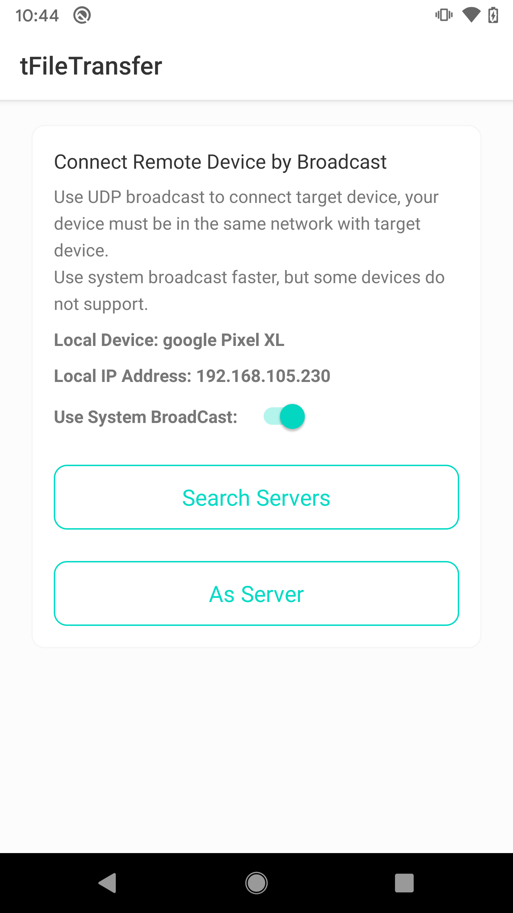
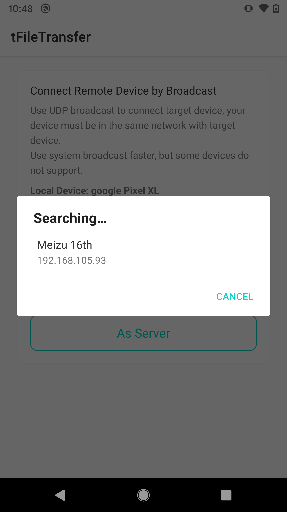
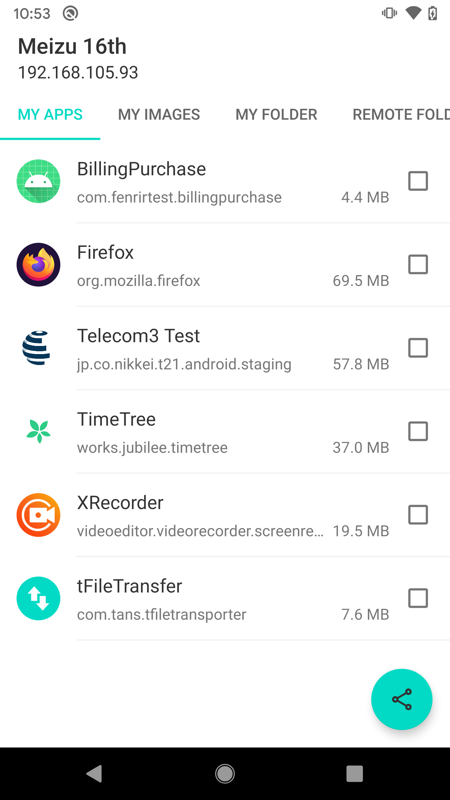
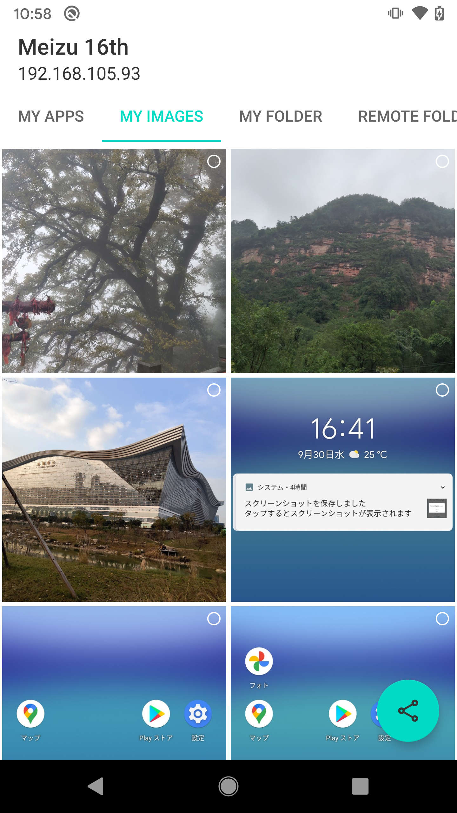
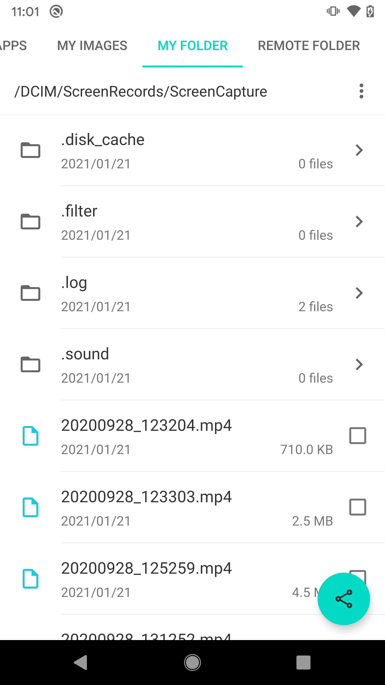
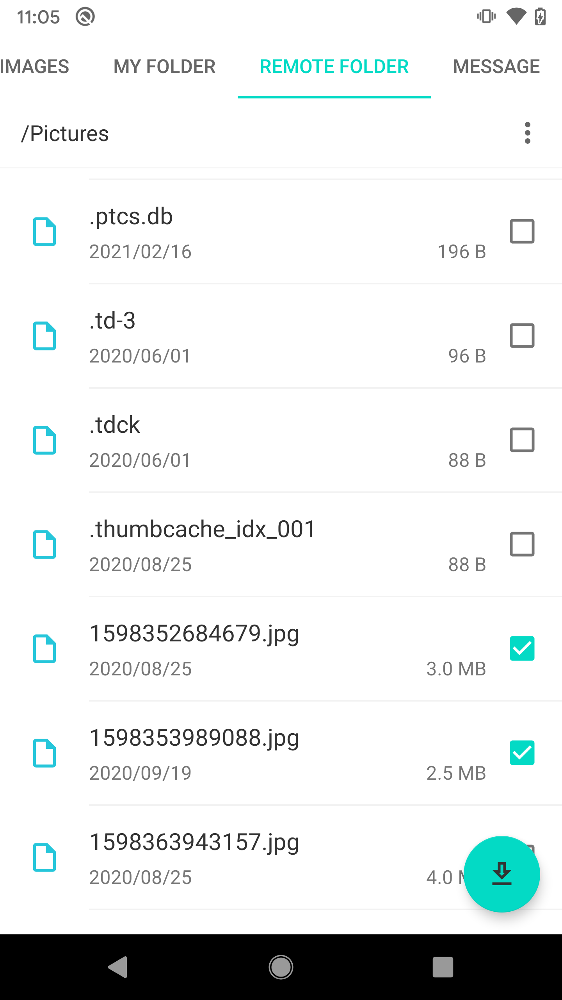
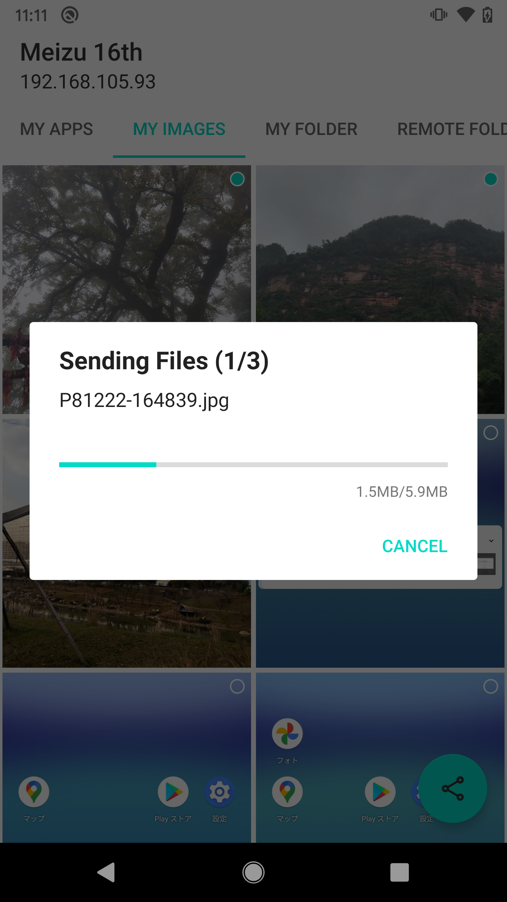
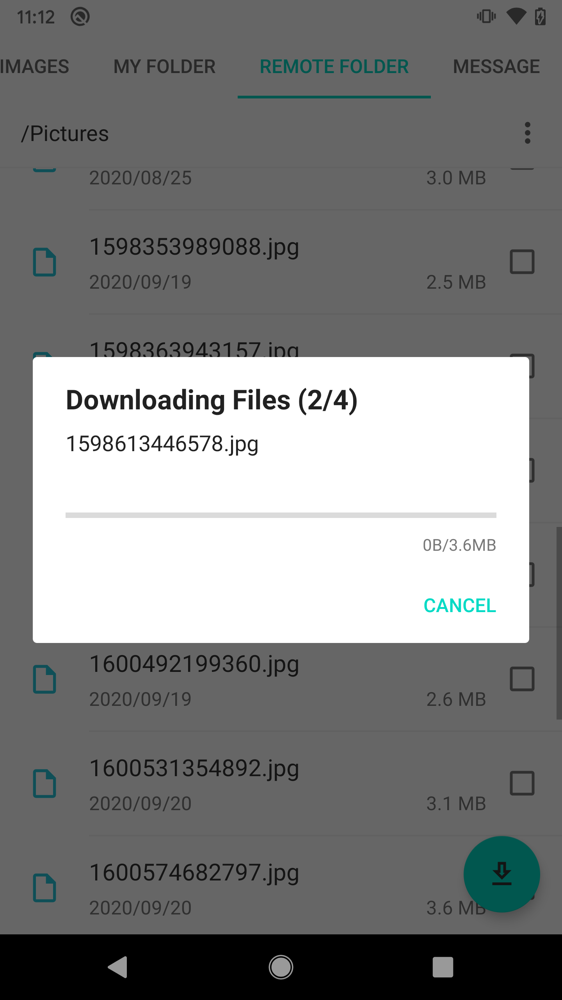
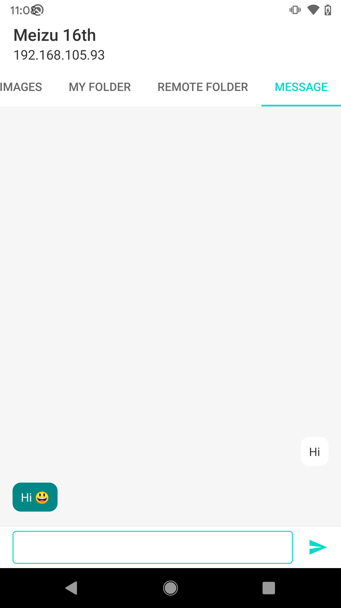

## Summary
This Demo code is for only for learning pepose who is Just started a android mobile app development.
Create tcp connections to transfer files without Internet.  
  
Create connections ways:
- Wi-Fi P2P/Direct (Recommend， Super Fast) (No LocalNetwork Limit)
- Scan QR Code (LocalNetwork Limit)
- UDP Broadcast (LocalNetwork Limit)

## Screenshots

    

   

   

  

<!-- CONTACT -->
## Contact

Pinankh Patel - pinankhpatel@hotmail.com

Linkedin: https://www.linkedin.com/in/pinankh-patel-19400350/

